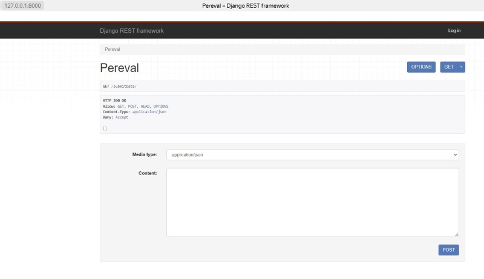
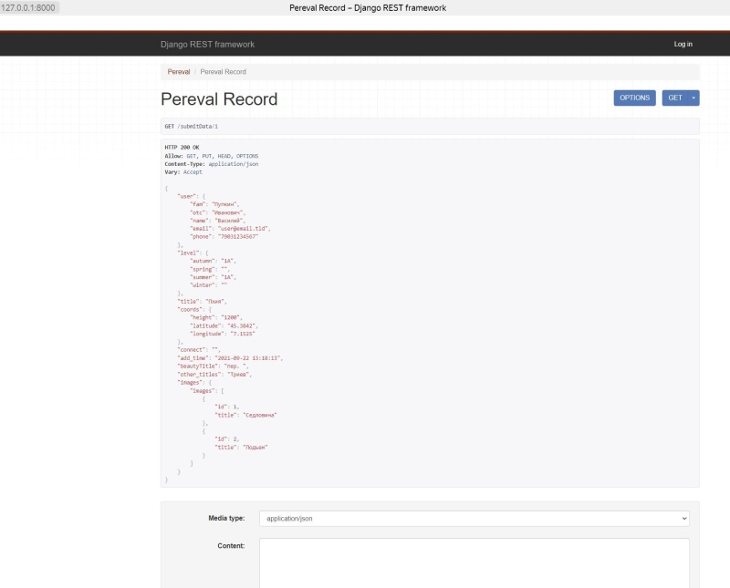
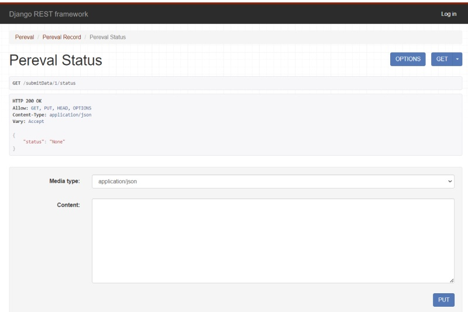

# Документация по RestAPI запросам

### URLs
  GET   /submitData/    
  POST  /submitData/    
* Просмотр и добавление новых записей: http://127.0.0.1:8000/submitData/    
> *Пример запроса:* http://127.0.0.1:8000/submitData/   

 

### /submitData/{id}

  GET  /submitData/{id}    
  POST /submitData/{id}    
* Просмотр и редактирования конкретной записи: http://127.0.0.1:8000/submitData/<int:pk>

> *Пример запроса:* http://127.0.0.1:8000/submitData/1

### /submitData/{id}/status

#### GET /submitData/{id}/status
Получение статуса записи: http://127.0.0.1:8000/submitData/<int:pk>/status

>*Пример запроса:* http://127.0.0.1:8000/submitData/1/status

### COMMANDS:
#### Запуск сервера
    python manage.py runserver
  